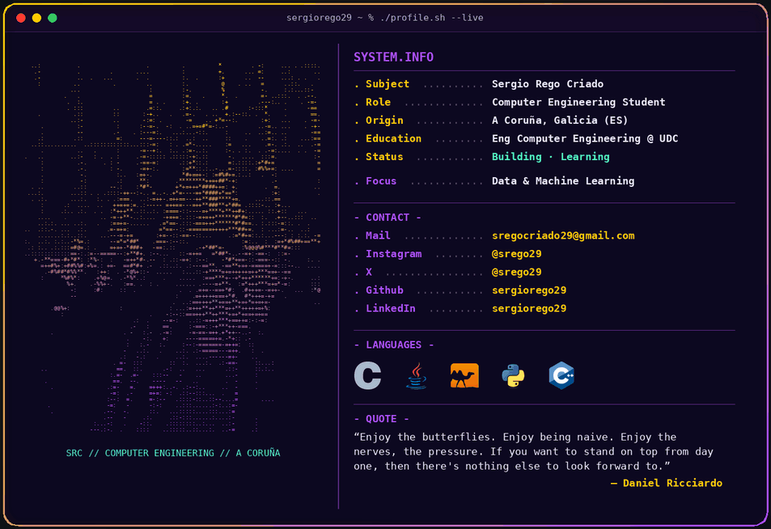

<picture>
  <source media="(prefers-color-scheme: dark)" srcset="./assets/terminal_banner_dark.gif">
  <source media="(prefers-color-scheme: light)" srcset="./assets/terminal_banner_light.gif">
  
</picture>

